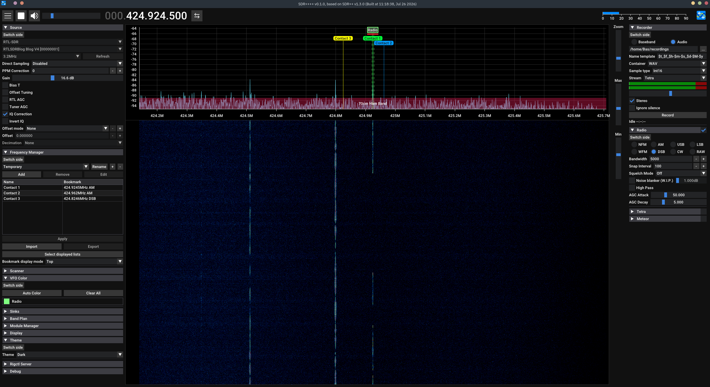

# SDR++++, an SDR++ expansion


## Features
**Features added by this fork:**
* Improved bookmarks
  * Bookmarks displayed on FFT / waterfall plot now stack instead of overlapping
  * Bookmark color can be customized
* VFO
  * The VFO indicator now displays its name
  * The VFO indicator is colored more clearly
  * The VFO bandwidth indicator visibility is improved
* Menu
  * Added menu bar on right side [WIP]
* FFT / waterfall plot
  * Added ability to zoom using CTRL + mouse wheel

**SDR++ features:**
* Multi VFO
* Wide hardware support (both through SoapySDR and dedicated modules)
* SIMD accelerated DSP
* Cross-platform (Windows, Linux, MacOS and BSD)
* Full waterfall update when possible. Makes browsing signals easier and more pleasant
* Modular design (easily write your own plugins)


## User Manual
See the [manual](./wiki/manual.md) for information regarding controls and usage of this software.

## Installation
### Pre-built
Pre-built binaries for various platforms are available via the [releases page](https://github.com/Bas-W/SDR4P/releases).

#### Windows
Download the latest release from the [releases page](https://github.com/Bas-W/SDR4P/releases)
and extract to the directory of your choice.

#### Linux
##### Debian-based (Ubuntu, Mint, etc)
Download the latest release from the [releases page](https://github.com/Bas-W/SDR4P/releases)
and extract to the directory of your choice.

Then, use apt to install it:

```sh
sudo apt install path/to/sdr4p_debian_amd64.deb
```

**IMPORTANT: You must install the drivers for your SDR module.
Follow instructions from your manufacturer as to how to do this on your particular distro.**

#### Android
Download the latest release from the [releases page](https://github.com/Bas-W/SDR4P/releases)
and install the .apk file.  
Depending on your android version, you may have to allow apps to be installed from external sources.

### From source
See the build instructions at https://github.com/AlexandreRouma/SDRPlusPlus

## Goal
This fork serves as a place to keep my modifications to SDR++, mostly UI/UX related.

## Credits
[Alexandre Rouma](https://github.com/AlexandreRouma), developer of SDR++.

See [the SDR++ repo](https://github.com/AlexandreRouma/SDRPlusPlus) for a full list of upstream contributors.

### Libraries used
* [ImPlot](https://github.com/epezent/implot)
* [Tracy Profiler](https://github.com/wolfpld/tracy)

### Libraries used upstream

* [SoapySDR (PothosWare)](https://github.com/pothosware/SoapySDR)
* [Dear ImGui (ocornut)](https://github.com/ocornut/imgui)
* [json (nlohmann)](https://github.com/nlohmann/json)
* [rtaudio](http://www.portaudio.com/)
* [Portable File Dialogs](https://github.com/samhocevar/portable-file-dialogs)
